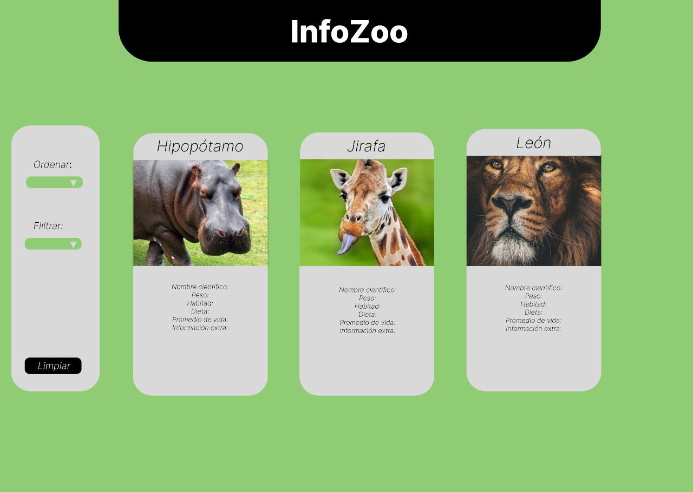
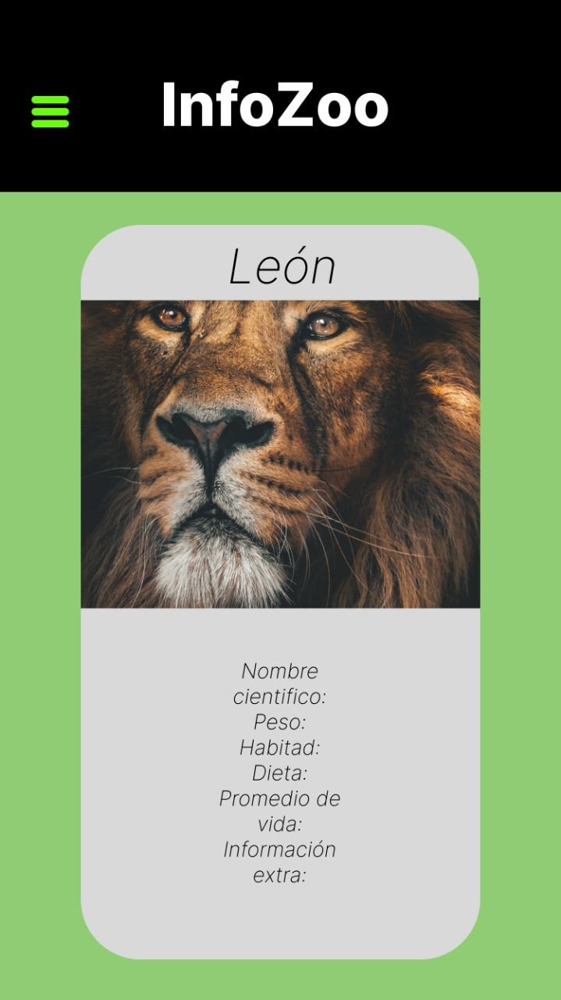
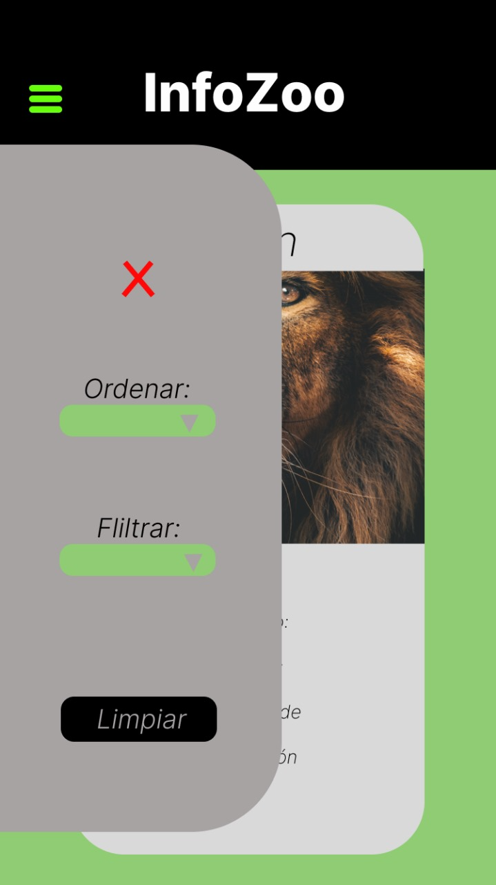
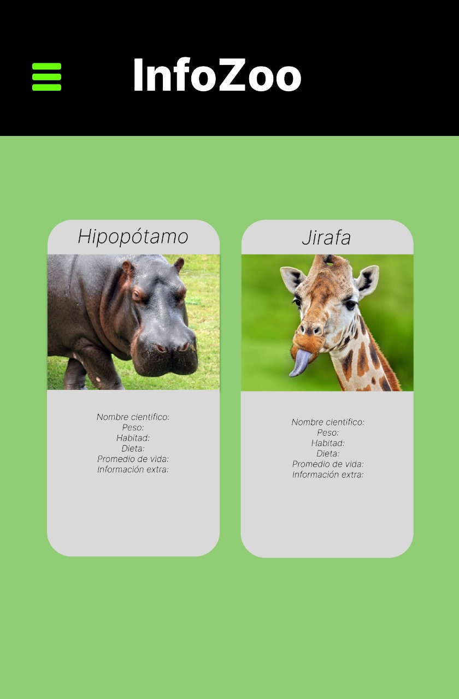
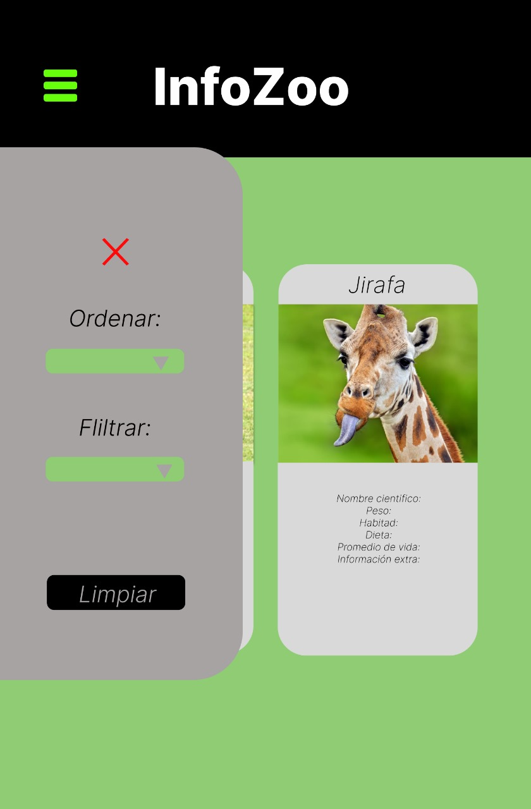
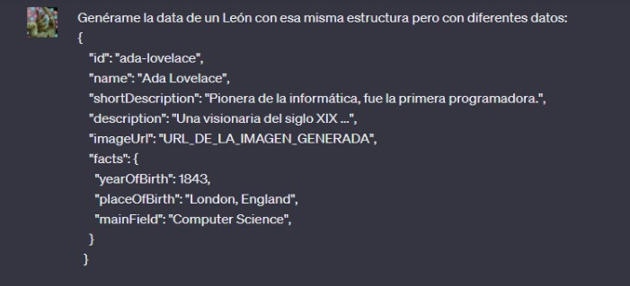
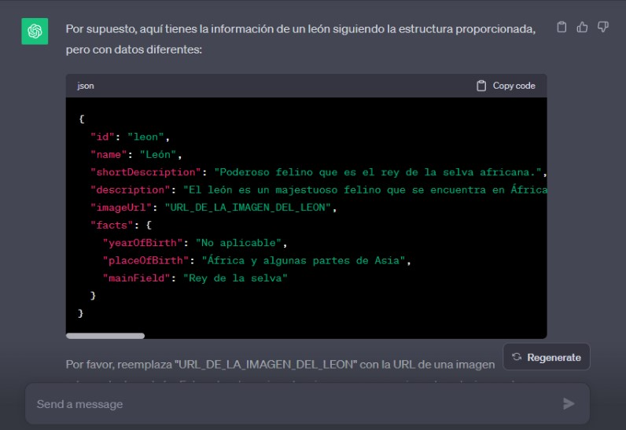

# Dataverse

## Diseño de la Interfaz de Usuaria

Buscamos crear una interfaz simple pero atractiva al usuario en donde pueda observar el contenido en tarjetas de una forma facil, creamos tres columnas para la versión en desktop, dos columnas para la versión en tablet y 1 columna para la versión en mobile.
En la version mobile y tablet creamos un menú hamburguesa en donde se podra filtrar, ordenar y limpiar el contenido de igual manera que el la interfaz desktop, pero de una forma mas compacta. De esta forma lo que esperamos es que el usuario tenga una vista completa de las tarjetas.

### 1. Prototipo desktop:

 

### 2. Prototipo Mobile:

 

### 3. Prototipo Tablet:

 

## Captura de pantalla del prompt utilizado para generar los datos

  